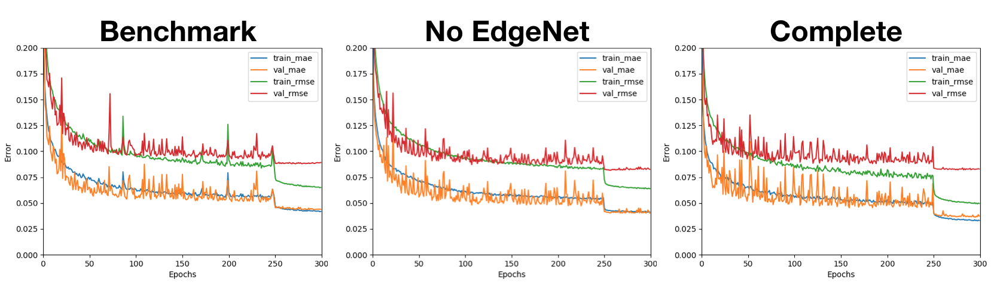
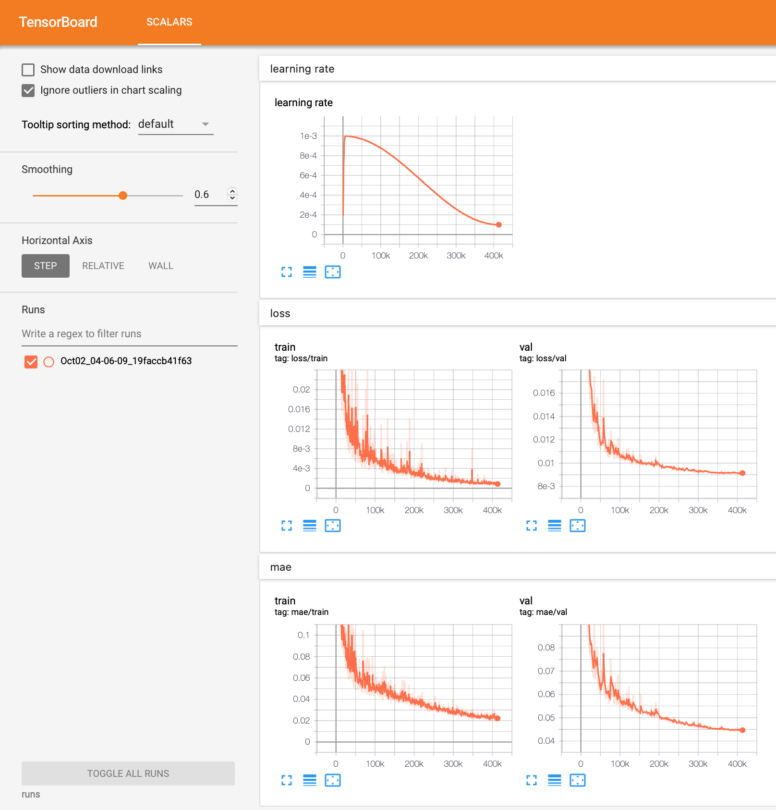

[](https://colab.research.google.com/github/Tony-Y/oqmd-v1.2-dataset-for-cgnn/blob/main/CGNN_oqmd_fe_benchmark.ipynb)
\(Click on this link if you want to create a Colab notebook for training a CGNN model.\)

# Examples

The benchmark, no-EdgeNet, and complete models, which are described in the CGNN paper, are presented below as examples.

## Benchmark Model
The directory `oqmd_fe_benchmark` contains a shell script that trains the benchmark model for the formation energy prediction.

**Model Definition**
```
--n_hidden_feat 96 \
--n_graph_feat 192 \
--n_conv 4 \
--n_fc 2 \
--use_batch_norm \
--full_pooling \
--gated_pooling \
```

You can train this model as follows:
```
cd oqmd_fe_benchmark
bash run_oqmd.sh >& log_oqmd &
```

## No EdgeNet Model
The directory `oqmd_fe_noEdgeNet` contains a shell script that trains the CGNN model without the EdgeNet for the formation energy prediction.

**Model Definition**
```
--n_hidden_feat 96 \
--n_graph_feat 192 \
--n_conv 4 \
--n_fc 2 \
--use_batch_norm \
--full_pooling \
--gated_pooling \
--n_postconv_net_layers 2 \
--use_postconv_net_batch_norm \
```

You can train this model as follows:
```
cd oqmd_fe_noEdgeNet
bash run_oqmd.sh >& log_oqmd &
```

The directories `oqmd_vol_noEdgeNet`, `oqmd_bg_noEdgeNet`, and `oqmd_mag_noEdgeNet` also contain a shell script for the volume, band gap, and total magnetization predictions, respectively.

## Complete Model
The directory `oqmd_fe_complete` contains a shell script that trains the complete CGNN model for the formation energy prediction.

**Model Definition**
```
--n_hidden_feat 96 \
--n_graph_feat 192 \
--n_conv 4 \
--n_fc 2 \
--use_batch_norm \
--full_pooling \
--gated_pooling \
--n_postconv_net_layers 2 \
--use_postconv_net_batch_norm \
--n_edge_net_feat 144 \
--n_edge_net_layers 1 \
--use_fast_edge_network \
--fast_edge_network_type 1 \
--use_edge_net_shortcut \
```

You can train this model as follows:
```
cd oqmd_fe_complete
bash run_oqmd.sh >& log_oqmd &
```

## Results
(These results were obtained using CGNN v1.0)

**Training histories**



**Testing errors for the formation energy predictions, and training speeds and times**

| Model      | RMSE (meV) | MAE (meV)  | Speed (examples/sec) | Time   |
|------------|-----------:|-----------:|---------------------:|-------:|
| Benchmark  |       86.8 |       43.5 |                13868 | 2h 42m |
| No EdgeNet |       83.8 |       41.1 |                11372 | 3h 18m |
| Complete   |       82.8 |       36.7 |                 5490 | 6h 50m |
| Ensemble   |       77.0 |       34.4 |                   NA |     NA |
| Database   |      124.2 |       84.8 |                   NA |     NA |

The benchmark, no-EdgeNet, and complete models were trained on a single GeForce GTX 1080 GPU. The ensemble prediction is the average of three predictions computed by those  models. The database error is the formation energy difference between the OQMD and the Materials Project entry, as described in the CGNN paper. The formation energy errors are expressed in milli-electron volts (meV).

**Testing errors for the volume deviation predictions**

| Model      | RMSE   | MAE    |
|------------|-------:|-------:|
| No EdgeNet | 0.0319 | 0.0175 |
| Database   | 0.0421 | 0.0270 |

The volume deviation is defined by 1 - Va/Vc, where Va denotes the total atomic volume, and Vc denotes the cell volume.

**Testing errors for the band gap predictions**

| Model      | RMSE   | MAE    |
|------------|-------:|-------:|
| No EdgeNet | 0.2602 | 0.0502 |
| Database   | 0.5288 | 0.1806 |

The band gap errors are expressed in electron volts.

**Testing errors for the total magnetization predictions**

| Model      | RMSE   | MAE    |
|------------|-------:|-------:|
| No EdgeNet | 0.1978 | 0.0826 |
| Database   | 0.4003 | 0.0938 |

The total magnetization errors are expressed in Bohr magnetons per atom.

Note that we could obtain results slightly different from the paper's ones, especially in the RMSE metric, because the splitting of the OQMD dataset differs between this repository and the CGNN paper.

# Results by CGNN v1.1
You can see a training result at this [Kaggle Notebook](https://www.kaggle.com/code/tonyyy/cgnn-dev-v1-1-oqm9hk).
If you try to train a CGNN model, click on the "copy & edit" button on this notebook and run your copy.

The CGNN models were trained using PyTorh 1.10.2 with CUDA 10.2 or 11.3 on a single Nvidia P100 GPU.

**Testing errors of formation energy**
| Dataset | Model      |Decoupled WD| CUDA | RMSE (meV) | MAE (meV)  | Time   |
| ------- |------------|:----------:|------|-----------:|-----------:|-------:|
| OQMD    | Benchmark  |            | 10.2 |       84.8 |       42.6 | 1h 21m |
|         |            |         ✅ | 11.3 |       89.5 |       43.3 | 1h  2m |
|         | No EdgeNet |            | 10.2 |       81.1 |       40.1 | 1h 40m |
|         |            |         ✅ | 11.3 |       84.9 |       40.8 | 1h 17m |
|         | Complete   |            | 10.2 |       82.4 |       36.6 | 2h 9m |
|         |            |         ✅ | 11.3 |       84.6 |       38.9 | 1h 33m |
| OQM9HK  | Complete   |         ✅ | 11.3 |       94.0 |       45.0 | 4h 54m |

**Testing errors of volume deviation**
| Dataset | Model      |Decoupled WD| CUDA | RMSE   | MAE    | Time   |
| ------- |------------|:----------:|------|-------:|-------:|-------:|
| OQMD    | No EdgeNet |            | 10.2 | 0.0317 | 0.0175 | 1h 41m |
|         |            |         ✅ | 11.3 | 0.0321 | 0.0164 | 1h 19m |
| OQM9HK  | No EdgeNet |         ✅ | 11.3 | 0.0321 | 0.0168 |        |

**Testing errors of band gap**
| Dataset | Model      |Decoupled WD| CUDA | RMSE   | MAE    | Time   |
| ------- |------------|:----------:|------|-------:|-------:|-------:|
| OQMD    | No EdgeNet |            | 10.2 | 0.2582 | 0.0496 | 1h 39m |
|         |            |         ✅ | 11.3 | 0.2541 | 0.0484 | 1h 19m |
| OQM9HK  | Complete   |         ✅ | 11.3 | 0.3645 | 0.0778 | 4h 55m |

**Testing errors of total magnetization**
| Dataset | Model      |Decoupled WD| CUDA | RMSE   | MAE    | Time   |
| ------- |------------|:----------:|------|-------:|-------:|-------:|
| OQMD    | No EdgeNet |            | 10.2 | 0.1986 | 0.0815 | 1h 39m |
|         |            |         ✅ | 11.3 | 0.1974 | 0.0816 | 1h 18m |
| OQM9HK  | No EdgeNet |         ✅ | 11.3 | 0.1880 | 0.0630 | 3h 15m |

**TensorBoard of training a complete CGNN model on the OQM9HK dataset for formation energy**


(c) 2019-2022 Takenori Yamamoto
